## pr 저장소와 기존 저장소의 병합이 실패하는 경우
병합 문제만을 해결하고자 하시면 [여기](#병합-문제-해결하기) 참고해 주세요.

## 1. 기존 작업물에 FORK 저장소 추가하기

우와테크코스 저장소에서 Fork하여 레포지토리를 만든 이후
기존에 작업한 브랜치에 접속합니다.

인텔리제이 하단 git 탭을 클릭하여 Remote 항목에서 오른클릭 -> Manage Remotes 를 클릭


`+` 버튼을 클릭하여 연결할 원격 저장소를 지정합니다.
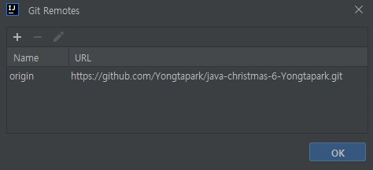


우와테크코스에서 Fork 하여 생성한 내 저장소의 주소를 추가합니다
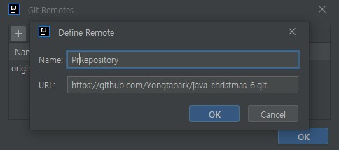


처음에 바로 git 목록을 확인하시면 추가한 Fork 저장소가 보이지 않아 당황할수도 있는데요,

파란색 화살표 버튼 (Fetch All Remotes) 을 클릭하시면 원격 저장소 상태가 최신화 됩니다.
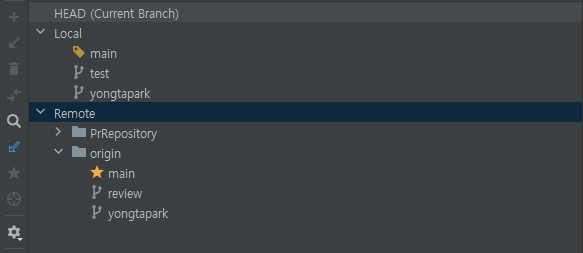

추가된 `PrRepository`로 새로운 브랜치를 만들어 체크아웃 합니다.
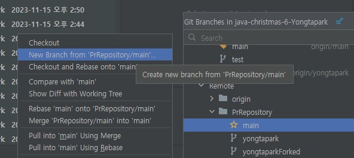

이 상태가 되면 우리가 Fork 했던 저장소의 데이터들을 가져오므로,

당연히 기존 브랜치와는 다르게 초기의 아무것도 없는 기본 모습일 것입니다.

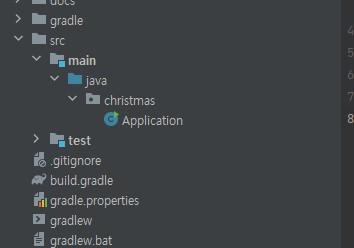

## 2. 브랜치 병합하기

여기서 기존 작업물 브랜치와 병합하여 PR을 시도해보겠습니다.

현재 Fork 한 저장소에서 만든 브랜치인 prTest에서 병합하고자 하는 브랜치를 클릭한 후

`` Merge '기존저장소브랜치' into 'Fork 브랜치'  ``를 클릭합니다.

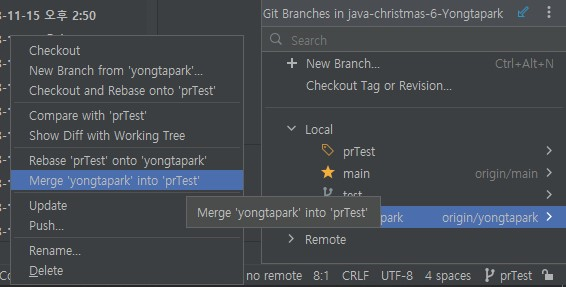


## 3. 병합 문제 해결하기

앗 오류가 발생합니다.  
관련 없는 이력의 병합을 거부한다고 하네요.


이 오류는 두개의 브랜치가 서로 다른 커밋 히스토리를 가지고 있을 때 발생한다고 하는데요.

두 브랜치를 비교해보니 현재 Fork 된 저장소에

기존 저장소에서는 없던 커밋이 하나 존재하는듯 합니다.

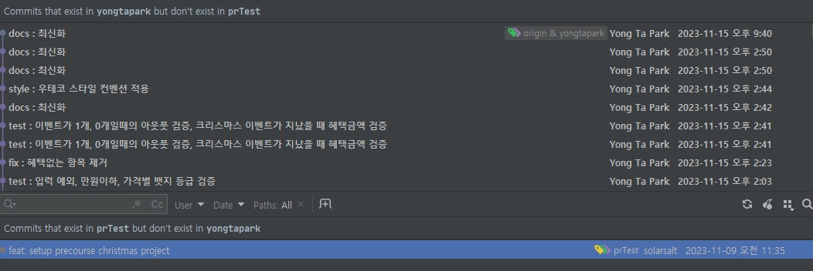

커밋 히스토리가 달라서 병합이 불가능한 경우
강제로 병합할 방법이 존재합니다.
```
git merge <기존저장소브랜치> --allow-unrelated-histories
```

위 명령어를 터미널에서 입력해줍시다.

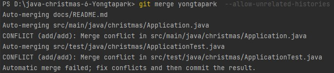

그러면 이렇게 병합된 모습을 볼 수 있습니다.

일단 오류가 많지만 무시하고 커밋을 시도합니다

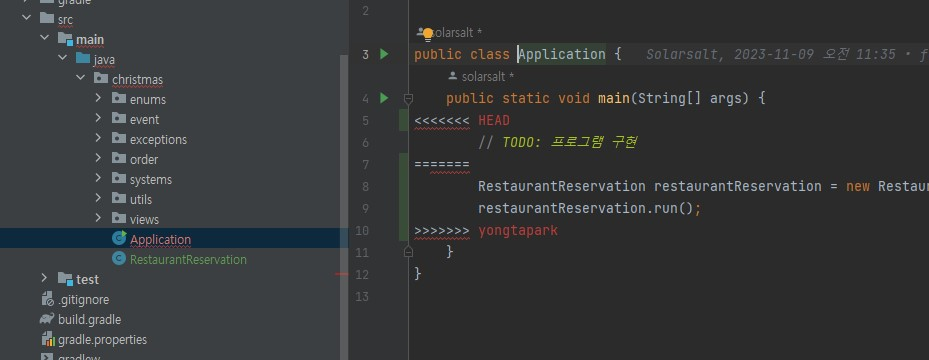


그러면 인텔리제이에서 충돌 사항들을 같이 보여주는데요,

Resolve를 클릭합시다.

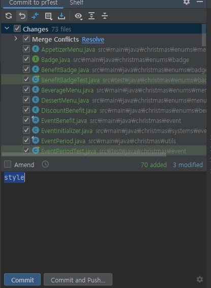

그러면 이렇게 네 파일로 푸시할 것인지(Accept Yours),

기존 Fork 저장소의 파일로 푸시할 것인지(Accept Theirs)

아니면 병합한 체로 푸시할 것인지(Merge) 선택하라고 나오는데요.

전부 `Accept Yours`를 클릭합니다.

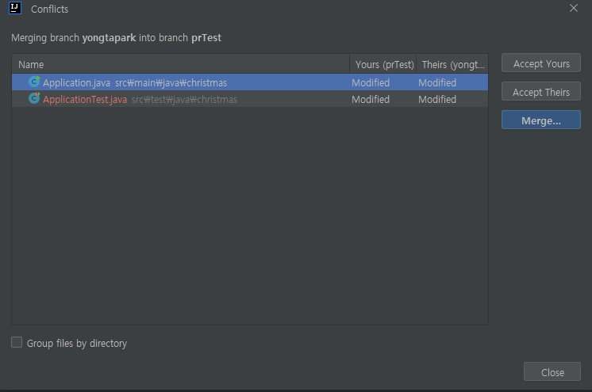

이후 다시 커밋을 시도하면 성공하는것을 볼 수 있는데요

다만 이렇게 저는 기존 저장소인 `origin`으로 설정되어있네요

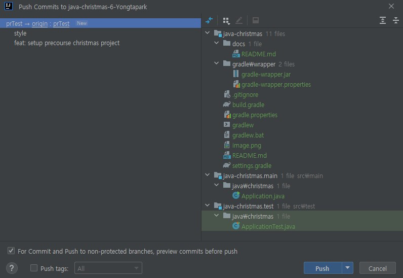


클릭해서 Fork 저장소로 변경해줍니다.

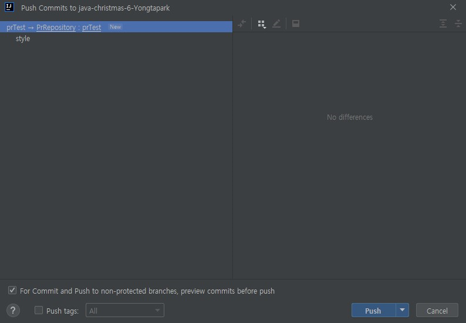

그러면 이렇게 커밋이 성공하는걸 볼 수 있습니다.

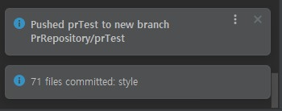

이제 Fork 한 저장소로 이동해 확인해봅시다.

커밋은 잘 진행되었네요.

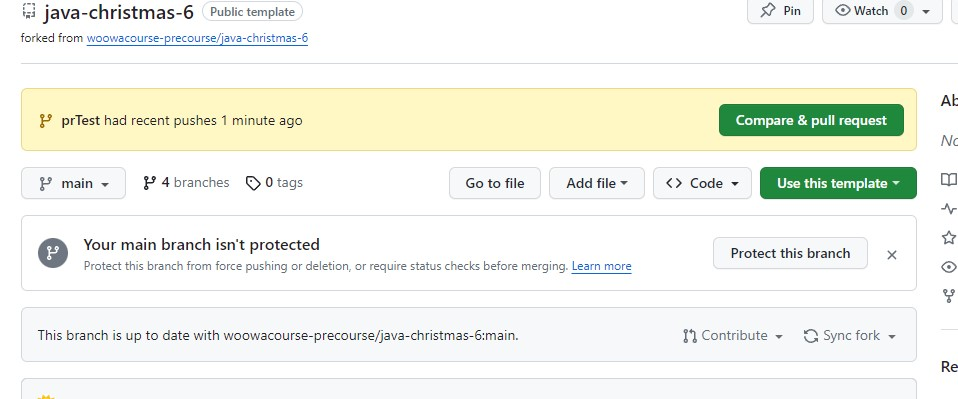

그럼 이렇게 PR이 가능해집니다.

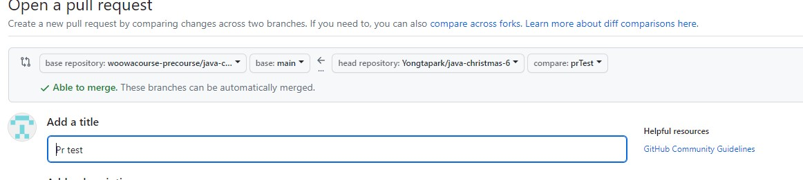


