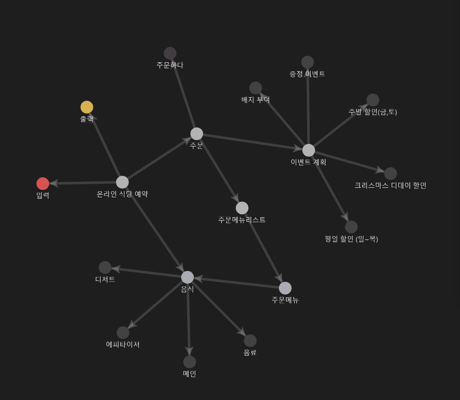
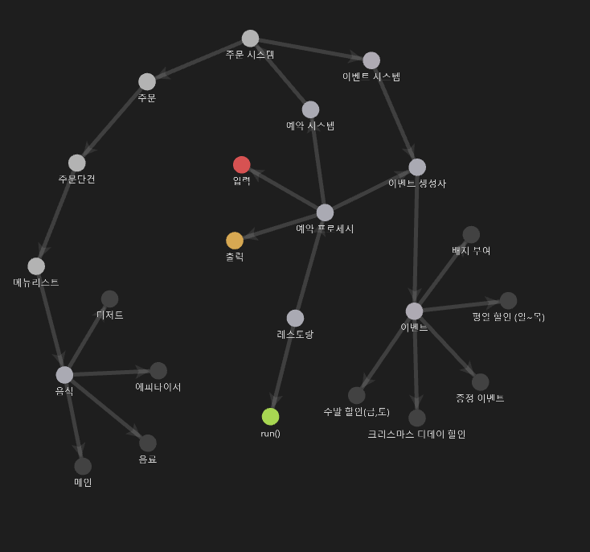

## 개념도

### 초기 구현


### 실제 구현


## 구현 계획

- [x] 메뉴 수량, 가격 계산 구현
- [x] 이벤트 구현
  - [x] 크리스마스 이벤트 구현
  - [x] 주말, 주중 이벤트 구현
  - [x] 특별 이벤트 구현
  - [x] 증정 이벤트 구현
- [x] 뱃지 시스템 구현
- [x] 이벤트 예외 구현(만원이하 이벤트 무효)
- [x] 입 출력 구현 
  - [x] 입력
  - [x] 출력
- [x] 오더 시스템 구현
- [x] 입력 예외 구현
  - [x] 주문 : 음료만 주문, 중복주문, 0개주문, 포맷, 존재하지 않는 메뉴, 20개 초과 주문시, Integer보다 범위가 클 시
  - [x] 날짜 : 숫자가 아닐 시, 범위를 벗어날 시, Integer보다 범위가 클 시
  - [x] 예외 시 종료되지 않고 질문 반복하기
## 구현 현황

<details>
<summary>(23.11.09)</summary> 

- [x] 개념도 설계 및 구현계획 작성 
- [x] 음식,주문, 주문목록, 주문메뉴 구현
- [x] 테스트 코드 구현
  - 음식 : 문자열로 Enum 반환 검증
  - 주문메뉴 : 메뉴가격, 문자열로 주문메뉴 반환 검증
  - 주문목록 : 총 가격 반환 검증 
- [x] 문자열로 Enum 반환 방식 변경
  - interface 내부에 hashMap 인스턴스로 구현
    - 문제점
      - 초기화 되지 않으면 값을 찾을수 없는 문제가 존재
      - 또한 MenuItem 에서 바로 hashMap 접근 가능한 문제가 존재
    - 해결
      - hashMap 을 가지는 유틸리티 클레스인 MenuList 추가
        - 정적 초기화를 사용하여 MenuList가 실행 될 때 음식메뉴들을 전부 저장하도록 구현
        - 정적 초기화를 사용하면 해당 객체를 최초 호출하여 JVM 에 로드될 때 메뉴 리스트를 초기화 함.
- 배운점
  - 정적 초기화 : static {} 
    - 해당 클래스가 처음으로 JVM에 로드 될 때 실행된다.
    - 애플리케이션이 구동되는 과정 중에 특정 클래스가 처음 사용되면, JVM은 그 클래스를 메모리에 로드하고 정적 초기화 블록을 실행한다.
    - 이후에는 추가적인 정적 초기화가 발생하지 않는다.
    - 클래스의 코드가 실행 될 때 로드되므로, 정적 초기화 블록도 그 시점에 실행된다. 
    - 이러한 메커니즘을 Lazy Loading(지연로딩), 또는 Class Loading on Demand 라고 한다.
    
  - lazy loading(지연로딩)
    - JPA 에서만 사용하는 용어인줄 알았으나, 프로그래밍 전반에 걸쳐 사용되는 용어라는것을 배움
    - 필요할 때까지 데이터나 객체의 로드를 연기하는 기법
    - JVM의 기본 동작. 기본값
    - 메모리 사용을 최적화하고, 애플리케이션의 시작 시간을 단축하며, 불필요한 계산을 방지한다.
    - Java의 경우에도, 클래스가 사용되기 전까지는 로딩을 연기한다.
    - 지연 초기화라는 비슷한 용어가 존재하나 다른 개념이다.
    
  - lazy initialization(지연 초기화)
    - 객체가 실제로 사용될 때까지 연기하는 디자인 패턴
    - 개발자가 명시적으로 구현해야 함
    - 리소스가 많이 소모되는 객체 생성을 최적화 하는데 사용
    - 객체가 필요할 때까지 인스턴스화를 연기하여 불필요한 메모리 사용을 줄이고, 초기화에 소요되는 비용을 절약
    
  - 유틸 클레스의 초기화 시점
    - 이전에는 단순히 애플리케이션이 실행 될 때 static 필드에 존재하는 클래스는 전부 초기화가 진행되는줄 알았으나, 지연로딩으로 인하여 해당 클래스에 접근하는 시점에 초기화 된다는것을 학습 
    
  - ConcurrentHashMap 의 필요 시점
    - 애플리케이션 런타임 중에 데이터가 추가되거나 삭제되는 중 동적이 변경이 발생할 때 사용한다.
    - MenuList가 현재는 변경 없이 읽기만 지원하므로 HashMap 만으로도 충분하다.
    
  - JVM의 로드과정 : 모든 클래스 로더는 클래스 로딩 및 초기화 과정을 거친다.
    - 1. 클래스 로더(Class Loaders) : 애플리케이션 실행 시 필요한 클래스를 로드하는 역할을 한다. 모든 클래스들이 필수적으로 로드되는것이 아니며, 모든것들은 필요할 때 로드된다.
      - 부트 스트랩 클래스 로더 : 자바 핵심 API들을 로드 ex) java.lang.Object
      - 확장 클래스 로더 : 표준 자바 API 확장 클래스들을 로드 ex) Java Cryptography Extension(JCE)
      - 시스템 클래스 로더 : 개발자가 작성한 클래스 및 사용자 지정경로에 있는 클래스 로드 ex)Spring Framework, JPA 등
    - 2. 클래스 로딩 및 초기화 : 클래스가 실제로 사용될 때까지 로딩 및 초기화가 연기된다.
      - 로딩 : 클래스 로더가 클래스를 메모리에 로드한다.
      - 링킹 : 로드된 클래스가 검증되고, 클래스 변수(static variables)에 메모리가 할당되며, 참조가 해석된다.
      - 초기화 : 클래스가 실제로 사용될 때 클래스 변수가 최종 값을 할당받고, 초기화 블록이 실행된다. 초기화 순서는 정적 필드와 블록이 먼저, 그 다음에 인스턴스 필드와 생성자가 실행된다.
    
</details>


<details>
<summary>(23.11.10)</summary>

- [x] 크리스마스 디데이 이벤트 구현
  - 이벤트 기간을 생성자 파라미터로 설정해 확장성 있게 설계하려 시도
  - ChronoUnit 사용하여 로직구현
- [x] 평일 할인 이벤트 구현
  - ```LocalDate.getDayOfWeek``` 를 사용하여 평일을 구하는 로직 구현
- [x] 주말 할인 이벤트 구현
- [x] 샴페인 증정 이벤트 구현
- [x] 인터페이스 메서드가 증가함에 따라 오버로딩이 아닌 각자의 메서드명을 설정
- [x] 특별 할인 이벤트 구현
- [x] 최상위 WooWaEvent 인터페이스를 상속하는 종목별 이벤트 인터페이스 구현
- [x] 각각의 구현 이벤트 클래스 파라미터로 기간,상품,할인율 등 스스로 결정할수있게 구현
- [x] 한달, 특정일, 특정주, 만큼의 기한을 생성할수있는 EventPeriod 구현
- [x] WeekDiscountEvent 주말(토,일) -> 주말(금,토)로 변경
- [x] 이벤트핸들러 구현

- [x] WooWaEvent 내부 메서드에 대한 고민
  - 이벤트 로직을 실행하는 ```execute()```
  - 이벤트 기간인지 확인하는 ```isEventActivate()```
  - 크리스마스 이벤트를 보면 어차피 ```isEventActivate()```는 ```execute()``` 시 포함되는데 public으로 둘 필요가 있을까?
    - ```isEventActivate()```를 private로 변경했을 때 예상
      - 캡슐화 원칙을 유지하여 객체 내 데이터를 외부에 노출하지 아니한다.
    - ```isEventActivate()```를 private로 변경했을 때 고민
      - 추후 어떤 로직(ex: 이벤트의 활성/비활성 상태를 확인하고 실행하는 로직)이 구현될지 몰라 섣불리 변경하기가 고민된다.
      - private로 구현해야한다면 다른 이벤트 클래스에 일일이 코드를 적어야한다
    - ```isEventActivate()```를 유틸클래스로 따로 추출했을 때 고민
      - 그렇다면 결국 interface에서 시작날짜와 종료날짜를 가져와야하므로, 코드는 복잡해지고, 이전보다 데이터도 외부에 더 자세히 노출된다.
    - 결론
      - 인터페이스에 ```isEventActivate()```를 사용하는것이 설계를 더 단순화하고, 내부정보를 덜 노출하며, 추후 확장성도 있다고 생각한다.
- [x] 크리스마스디데이할인 이벤트와 다른 이벤트들을 인터페이스로 묶는것에 대한 고민
  - 현재 인터페이스에서 ```execute()```가 받는 파라미터는 LocalDate 하나 뿐인데, 다른 로직들은 orderMenu를 추가적으로 받아야 한다.
    - 그냥 오버로딩해서 받아버리면 쉬울 일이지만, 의미없는 메서드가 생성되어버린다.
  - 해결방안
    1. LocalDate, OrderMenu를 새로운 클래스로 감싸 파라미터로 받는 방법.
       - 장점 : 미래에 파라미터에 추가 정보가 필요한 경우, 쉽게 확장이 가능하다.
       - 단점 : 매개변수를 전달하기 전에, 객체를 생성하여 전달하여야 한다. 코드가 약간 복잡해진다. 또한 크리스마스 할인의 경우 필요없는 OrderMenu 데이터까지 전송된다.
    2. default 메서드를 사용하여 ```isEventActivate()```를 오버로딩하고 둘다 default 메서드로 만드는 방법.
       - 장점 : 기존의 크리스마스 이벤트 클래스에 영향을 미치지 않으면서 새로운 메서드를 추가할 수 있다.
       - 단점 : default 메서드가 많아질수록 인터페이스가 더 복잡해진다.
  - 결론
    - 1번의 경우, 확장성이 좋다는 장점이 있으나, 이를 래핑할 경우 어떤 직관적으로 코드의 역할을 인지할수 없어 보인다.
    - 2번의 경우, 추가적인 메서드가 생길수록 인터페이스가 더 복잡해진다는 단점이 있으나, 현재까지의 이벤트와, 앞으로 이벤트를 생각하더라도, 파라미터가 크게 추가되지는 않아보인다. 또한 기존 코드에 영향이 없다는것이 큰 메리트다.
    - default 메서드를 사용하기로 결정
- [x] 이벤트들의 확장성에 대한 고민
  - 크리스마스 이벤트를 제외한 모든 이벤트들은 재사용 가능성이 높고 언제든 항목들이 바뀔 수 있다고 예상된다. (다음엔 주말에 음료를 할인한다던지)
    - 1월에 또 이벤트를 한다면, 기존의 이벤트들을 재사용 해야할 가능성도 존재하므로 결국 유지보수가 용이한 구조여야 한다. 
    - 그렇다면 확장성을 위해 이벤트들의 구조를 변경해야한다.
  - 구현방안
    - 주말, 주중 할인 이벤트의 경우
      - 할인 음식을 쉽게 지정할 수 있도록 변경
      - 할인 가격을 쉽게 지정할 수 있도록 변경
    - 상품 증정 이벤트의 경우
      - 최소 금액을 쉽게 지정할 수 있도록 변경
      - 증정 음식을 쉽게 지정할 수 있도록 변경
    - 특정 날짜 이벤트의 경우
      - 할인 금액을 쉽게 지정할 수 있도록 변경
      - 날짜를 쉽게 지정할 수 있도록 변경
  - 결론
    - 파라미터를 추가한다. ex) 예약일, 오더메뉴, 할인음식, 할인가격
    - 래핑 클레스를 만든다.
      - 크리스마스 이벤트 이후 새해 이벤트를 한다고 하였으니 EventPeriod를 기념일마다 정적팩터리 메서드로 생성할수있도록  구현
    - 최상위 이벤트 인터페이스를 확장한 증정, 주말/주중, 특별 이벤트 인터페이스를 구현하여 각자 구현한다. 
      - default 메서드도 제거되어 필요없는 메서드를 숨길 수 있다.
  - [x] 이벤트 핸들러 구현 문제
    - 현재 문제점
      - 모든 이벤트들을 관리하는 WooWaEventHandler를 구현하였으나, 음식종류 당 할인과, 전체 할인이 섞여있는 문제
    - 시도
      - 개별 계산 로직(주중,주말 음식들을 메인인지, 음료인지 확인)들을 orderMenu, Orders 에서 계산하여 수량을 반환
      - 반환한 해당 수량들을 주중, 주말 이벤트에서 받아 할인가 계산
      - 추가 문제 발생
        - 주중,주말 이벤트를 리펙토링하면서 생성자 파라미터로 원하는 할인 대상으로 지정하려 했으나, MainMenu.values() 만가능한 문제
      - 결론
        - MainMenu[], DessertMenu[] 를 파라미터로 받아 구현.

- 배운점
  - ChronoUnit
    - 날짜 및 시간을 측정하는 단위를 나타내는 열거형
    - ```ChrononUtit.DAYS.between(localDate1, localDate2)``` 를 이용하면 경과일수를 구할 수 있다. 
  - ```LocalDate.getDayOfWeek```
    - 원하는 날짜의 요일을 추출할 수 있다.
  
  - Stream.Builder<T>();
    - Stream<T> 인스턴스를 생성하는 데 사용된다.
</details>

<details>
<summary>(23.11.11)</summary>

- [x] 12월 이벤트 관련 enum 구현
- [x] 혜텍 관련 enum 구현
- [x] 뱃지 매니저 구현
- [x] 오더 시스템 구현
- [x] 만원 이하 결제 시 혜택 x 구현
- [x] 문자열을 추출하여 주문으로 만들기 구현

- 배운점
  - ```hashSet```의 비교 로직을 변경하기 위해서는 ```equals()``` 뿐만 아니라 ```hashCode()```도 로직을 수정해야 한다.
  - 결국 ```hashSet```은 ```hashCode()```를 기반으로 저장하기 때문에 ,동일한 ```hashCode()``` 일 때에, 같은 버킷 내에 ```equals()``` 동등성을 비교하기 때문이다.
</details>

<details>
<summary>(23.11.12)</summary>

- [x] 동일메뉴, 음료만주문, 0개주문, 수량에 문자열, 존재하지 않는 메뉴, 20개 초과 주문시 예외 검증
- [x] 날짜 관련 예외 검증
- [x] 오더 오더 시스템 구현
- [x] 유저인터페이스 임시 구현
- [x] 출력 시 할인이 포함되지 않으면 표시하지 않게 구현

- [x] hashMap에서 없는 단어를 입력해도 나오는 예외가 없는 문제
  - 왜 hashMap에서 없는 키값을 입력해도 반환값이 나올까?
    - hashMap은 기본적으로 null을 반환한다. 이를 제어하려면 추가적인 작업이 필요하다. 또한, null이 아닌 다른 처리를 위한 메서드도 존재한다.
    - ```map.containsKey("key")``` : 키값이 존재할 때와 그렇지 않을 때를 설정한다.
    - ```map.getOrDefault("key",return)``` : 특정 키를 입력했을 때 원하는 반환을 설정한다. 하지만 반환에 예외를 던질 수 없다.
    - hashMap 반환이 null인 경우를 예외로 잡아 처리한다.
  - 해결방안
    - ```map.containsKey("key")``` 를 사용하여 예외를 추가한다. 
      - null을 반환하는 경우에 대한 예외처리도 가능하나, 이런 예외는 특정값에 대한 예외지만, containsKey는 map에 키가 존재하지 않는지에 확인하는것에 대한 의도가 분명하므로 ```map.containsKey("key")```를 사용했다.

- [x] 특정 종류의 음식을 주문하면 예외를 발생시켜야하는 문제 
  - 그렇다면 특정 종류만 주문할 때 예외를 발생시키고자 한다면 어떤 로직을 짜야할까?
    - 반환형의 인스턴스가 내가 특정한 반환형의 인스턴스인지 비교한다.
    - 이는 특정 종류를 주문할때마다 예외를 발생시키면 안되므로, Set<Order> 에서 예외를 처리한다.
  
- [x] 주문 예외처리 이후 이벤트 관리 테스트에서 테스트 실패 발생
  - 문제
    - 상품명을 받아와 Enum으로 반환하는 과정에서 null 이 발생하여 예외가 발생
  - 해결방안
    - 없음을 의미하는 NONE Enum을 구현하여 반환하게끔 설정
      - 단지 없음을 의미하는 Enum이 MenuItem이라는 인터페이스를 implement 하는것이 옳은가?
    - 로직 자체를 Enum이 아닌 상품명만 반환하도록 설정
      - 이렇게 되면 증정품에 대한 가격을 할인하는 내역에 대한 코드의 수정이 필요하게 된다.
  - 해결
    - 증정 여부를 문자열대신 Enum으로 반환하게 설정
    - Menuitem을 상속받은 None 추가

- 배운점 
  - HashMap
    -존재하지 않는 키를 이용하여 값을 요청하면 null을 반환한다.
    - 존재하지 않을 때의 예외를 추가적으로 설정해야한다.
      - ```map.containsKey("key")``` : 키의 존재여부를 확인한다.
      - ```map.getOrDefault("key",return)``` : 키가 존재하지 않을 시, 원하는 값을 리턴한다.
</details>

<details>
<summary>(23.11.13)</summary>

- [x] 할인 혜택에 증정품이 존재하면 내역 추가 
- [x] 뱃지 매니저 제거, BenfitBadge enum에 로직 이동
- [x] 증정 이벤트에서 수량을 지정할 수 있도록 수정
- [x] EventSystem, EventInitializer -> 초기화, 실행 책임 분리
- [x] EventSystem 내부의 EventBenefit 설정여부 로직 분리

- [x] 할인 혜택에 증정품 추가 시 문제
  - 문제점
    - Events 라는 인터페이스로 묶은 이벤트명을 묶어놓은 Enum들만 현재 들어가게 되어있다.
    - 허나 상품은 Events 하위가 아니라 MenuItem 하위이다.
    - 상품과 이벤트는 구분이 명확하기에 하나의 인터페이스로 몰아서 합치기가 애매하다.
  - 해결 방안
    1. MenuItem과, Events가 상속할수 있는 상위 인터페이스를 만들고, OneEventResult의 파라미터로 한다.
    2. List<OneEventResult> 에 넣으려 하지 말고, 이들 출력 이후에 수동으로 증정품을 출력한다.
    3. 래퍼 클래스를 생성하여 이벤트와 증정품을 감싼다. - 하지만 이미 많은 래퍼 클래스가 존재하므로 복잡성이 더욱 증가하게된다.
    4. OneEventResult 인스턴스 변수를 파라미터에서 그대로 받는것이 아니라 가공해서 래퍼 클래스를 만들고, 그것을 변수로 받는다. 
  - 결정 
    - OneEventResult를 구성하는것은, 이벤트 enum과, 할인혜택인데, 이 enum은 사실 이름으로써의 역할 외에는 없다.
    - 변수타입을 Events 에서 String 으로 변환하여 이름과 할인가만 받도록 로직을 변경한다.
- [x] 뱃지 매니저 제거 및 로직 순서에 따른 값 변경 문제
  - 문제점
    - 뱃지 매니저의 역할은 주어진 혜택값에 따라 뱃지를 반환하는것이고, 이는 BenefitBadge 내에서도 구현 가능한 문제이다.
    - 뱃지 증정 여부를 반환하는 로직은 상위에 Santa를 두느냐, 혹은 다른 것들을 두느냐에 따라서 값이 달라졌다.
  - 해결 방안
    - 뱃지 매니저 제거, BenefitBadgeManager 내부에 로직 이동
    - 뱃지 enum 필드에 상/하한선 금액을 지정하도록 설정
    - 상/하한선 조건에 따라 뱃지 지정
- [x] EventSystem 의 책임 문제
  - 문제점
    - activateEvent 메서드에 이벤트 실행과, 이벤트 혜택의 상태를 결정하는 책임이 존재
  - 해결 방안
    - EventBenefit(이벤트 혜택) 상태 결정 로직을 EventBenefit 내부로 이주
      - EventBenefit의 파라미터에 주문 혹은 총주문금액을 추가하더라도 자신의 상태를 결정하는 로직 이외에는 사용처가 없다.
      - 문제는 EventBenefit의 조건이 Orders의 조건에 따라서 변하기 때문
      - Orders의 조건에 따라 EventBenefit의 상태를 변경하는것이 아니라, 스스로 변경하게 해야함
      - 스스로 변경하려면, 현재 파라미터를 받는 조건으로 참/거짓 유무를 판단할수있어야 한다.
    - EventBenefit 상태 결정 로직 제거, Receipt 객체에서 상태결정 로직 설정
      - Receipt 객체는 총주문금액을 파라미터로 가지며, 12월 이벤트의 최종 정보들을 포함한다
      - Receipt 내부의 총주문금액을 비교하여 참/거짓을 반환하는 메서드 구현
  - 결과
    - EventSystem에서 EventBenefit 상태설정 책임 제거 
    - Receipt 자체에서 총주문금액을 비교하여 참/거짓을 반환 
- 배운점
  - 사이드 이펙트
    - 증정 이벤트에서 증정 상품과 증정 상품의 개수를 지정하도록 변경하고자 했다.
    - 허나 그렇게 변경하려니 단순히 값만 이벤트에서 받는것 뿐만 아니라, 상품과 수량을 반환해야 하므로 상품을 위한 래퍼 클래스, 할인가를 계산하는 로직이 변경되어야 했다.
    - 다음 프로젝트를 시행할 때에는 각각의 값들의 변동 가능성을 염두하고 상세하게 계획을 수립한 후 구현해나가야 겠다.
</details>

<details>
<summary>(23.11.14)</summary>

- [x] 원하는 이벤트만 시행할수 있게끔 구현
- [x] RestaurantSystem - >RestaurantSystem, RestaurantProcessor 로 분리
- [x] 이벤트 인스턴스 Enum화
- [x] EventSystem 테스트 코드 구현
- [x] RestaurantSystem 테스트 코드 구현


- [x] 재사용성에 대한 고민
  - 크리스마스 이벤트 뿐만 아니라, 내가 원할 때의 이벤트를 내가 설정하는 프로그램을 만들고 싶다.
  - 이벤트의 기간, 혜택 등을 개발자가 쉽게 설정 할수 있어야 한다.
  - 해결방안
    - 이벤트 생성 로직을 가장 바깥으로 꺼낸다.
    - 이벤트들을 내가 원하는 대로 생성한 후 프로그램.run을 실행하면 실행하도록 구현한다.
    - 추가문제
      - 이벤트의 날짜, 금액 등을 변경가능하게 구현했으나, 이벤트 수를 줄이거나 늘릴수는 없다.
      - 해결방안
        - EventInitializer에서 필드값을 List<하위이벤트인터페이스>로 받는다.
        - EventSystem에서 각 인터페이스별 OneEventResult 를 받아 리스트에 저장한다.
  - 결과
    - RestaurantReservation 에서 초기화 시 EventInitializer, EventFactory 로 이벤트를 추가하여 시행
- [x] 필요성이 사라진 EventFactory의 제거여부
  - 이벤트 인스턴스를 Enum에 연결하면서 EventFactory의 필요성이 사라졌다.
  - 명확성을 위해서는 삭제하는게 맞지만, 추후에 Enum에 인스턴스 연결을 제거해야 할 수도 있다면, 제거하지 않는것도 좋을것같다.
  - 결론
    - 현재 불필요한 코드이므로 제거한다.
</details>

<details>
<summary>(23.11.15)</summary>

- [x] RestaurantProcessor 테스트 코드 구현
- [x] RestaurantReservation 테스트코드 구현
</details>

## 플로우
1. 사용자 - 예약 방문 날짜 입력
2. 사용자 - 주문 메뉴와 개수를 입력
3. 식당 - 결과 출력
   - 주문 메뉴 
   - 할인 전 총 금액
   - 증정 메뉴
   - 혜택 내역
   - 총 혜택 금액
   - 할인 후 예상 실제 결제 금액 
   - 12월 이벤트 배지

## 구현 기능 목록

### 0.유연한 이벤트 추가 기능

- [x] 이벤트 인스턴스를 Enum에 연결하여 Enum에서 바로 해당 이벤트 인스턴스를 반환받는다.
- [x] EventInitializer 를 이용해 이벤트들을 변경한다.

### 1. 주문 입력 및 유효성 검증 기능

- [x] 사용자로부터 주문할 메뉴와 수량을 입력받는다.
- [x] 입력된 메뉴가 존재하는지 확인한다.
- [x] 메뉴의 수량이 1 이상인지 확인한다.
- [x] 메뉴가 중복으로 입력되지 않았는지 확인한다.
- [x] 유효하지 않은 주문 입력 시 에러 메시지 출력 후 재입력 받는다.

### 2. 결제 금액 계산 기능

- [x] 할인 전 총 주문 금액을 계산한다.
- [x] 할인 금액을 적용하여 할인 후 예상 결제 금액을 도출한다.

### 3. 날짜 입력 및 유효성 검증 기능

- [x] 사용자로부터 예상 방문 날짜를 입력받는다.
- [x] 입력된 날짜가 1 이상 31 이하인지 확인한다.
- [x] 유효하지 않은 날짜 입력 시 에러 메시지 출력 후 재입력 받는다.

### 4. 할인 로직 구현

- [x] 크리스마스 D-day 할인 금액을 계산한다.
- [x] 평일 및 주말 할인을 적용한다.
- [x] 특별 할인 여부를 판단하고 적용한다.
- [x] 증정 이벤트 로직 구현
- [x] 총주문 금액이 120,000원 이상인 경우 샴페인 증정 여부를 결정한다.

### 5. 이벤트 배지 부여 로직 구현

- [x] 할인과 증정품을 포함한 총혜택 금액에 따라 이벤트 배지를 부여한다.
- [x] 5,000 이상 = 별
- [x] 10,000 이상 = 트리
- [x] 20,000 이상 = 산타


### 6. 결과 출력 기능

- [x] 주문 메뉴와 각 항목의 가격을 출력한다.
- [x] 할인 전 총주문 금액을 출력한다.
- [x] 증정 메뉴를 출력한다(해당되는 경우).
- [x] 적용된 모든 혜택의 내역을 출력한다.
- [x] 총혜택 금액을 출력한다.
- [x] 할인 후 예상 결제 금액을 출력한다.
- [x] 이벤트 배지를 출력한다.

### 7. 예외 처리 로직 구현

- [x] 총 주문 금액이 10,000원 미만인 경우 예외 처리한다.
- [x] 음료만 단독으로 주문된 경우 예외 처리한다.
- [x] 주문 가능한 메뉴의 최대 개수를 초과한 경우 처리한다.

## 상세 정보
### [주문 메뉴]
- <애피타이저>
  - 양송이수프(6,000)
  - 타파스(5,500)
  - 시저샐러드(8,000)
- <메인>
  - 티본스테이크(55,000)
  - 바비큐립(54,000)
  - 해산물파스타(35,000)
  - 크리스마스파스타(25,000)
- <디저트>
  - 초코케이크(15,000)
  - 아이스크림(5,000)
- <음료>
  - 제로콜라(3,000)
  - 레드와인(60,000)
  - 샴페인(25,000)

### [할인]
#### 크리스마스 디데이 할인 (2023.12.1 ~ 2023.12.25)
- 1,000원 으로 시작하여 크리스마스가 다가올수록 할인 금액 100원씩 증가
- 총주문 금액 - 디데이할인금액

#### 12월 할인 (2023.12.1 ~ 2023.12.25)
- 평일 할인(일요일~목요일)
  - 디저트
  - 2,023 원 할인
- 주말 할인(금요일,토요일)
  - 메인
  - 2,023 원 할인
- 특별 할인
  - 3,10,17,24,25,31 
  - 총 주문 금액에서 1,000 원 할인


### [증정 메뉴]
- 할인 전 총 금액 120,000 이상
  - 샴페인

### [12월 이벤트 배지]
- 5,000 원 이상
  - 별
- 10,000 원 이상
  - 트리
- 20,000 원 이상
  - 산타
